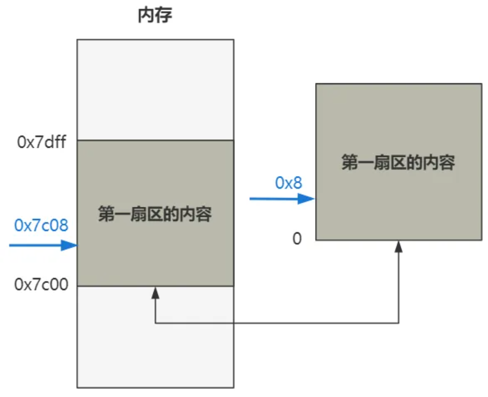
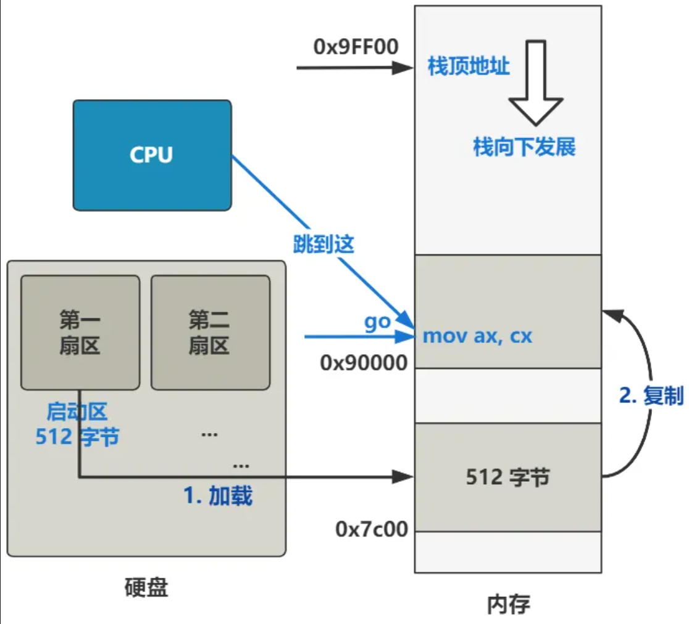
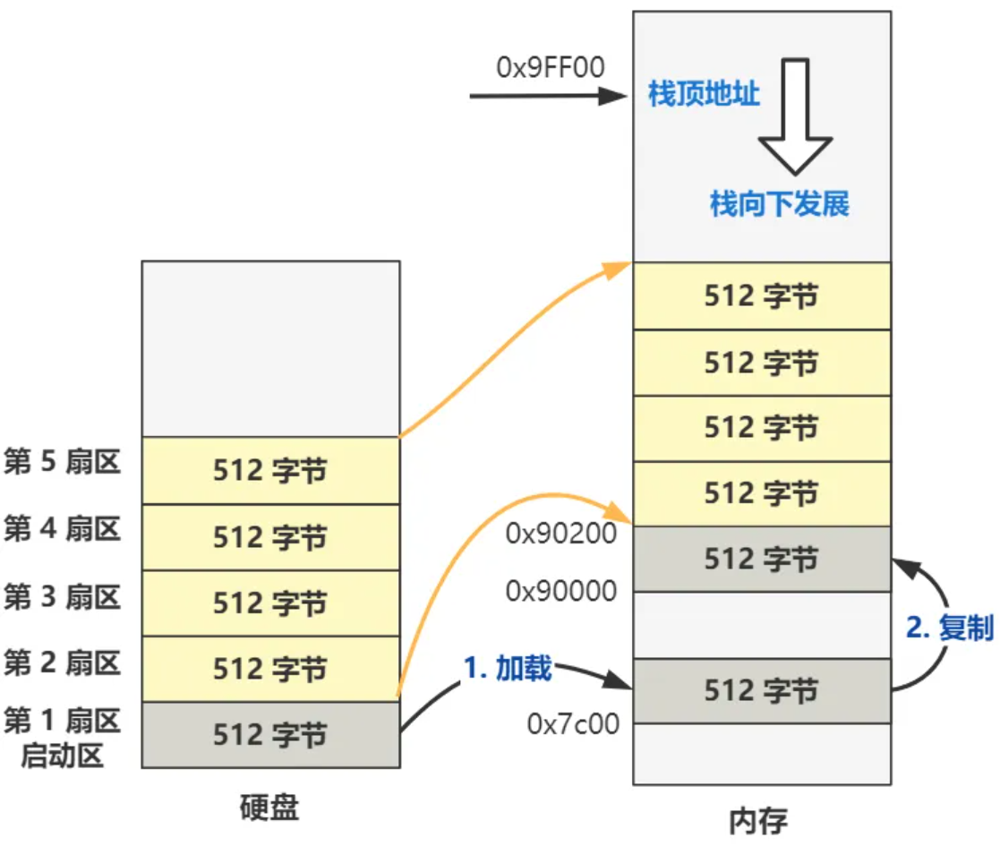
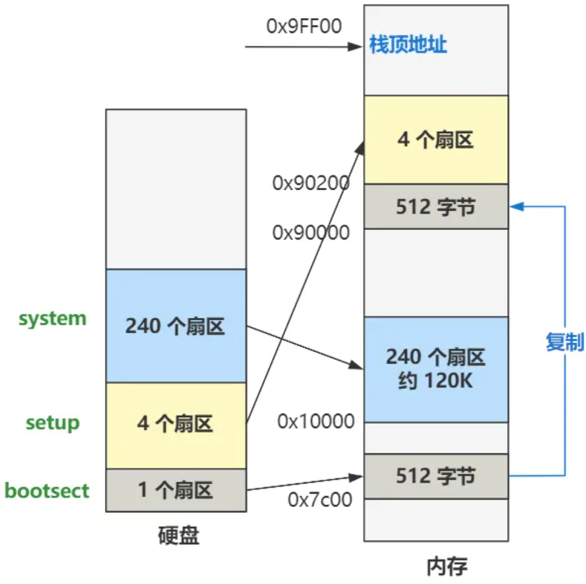
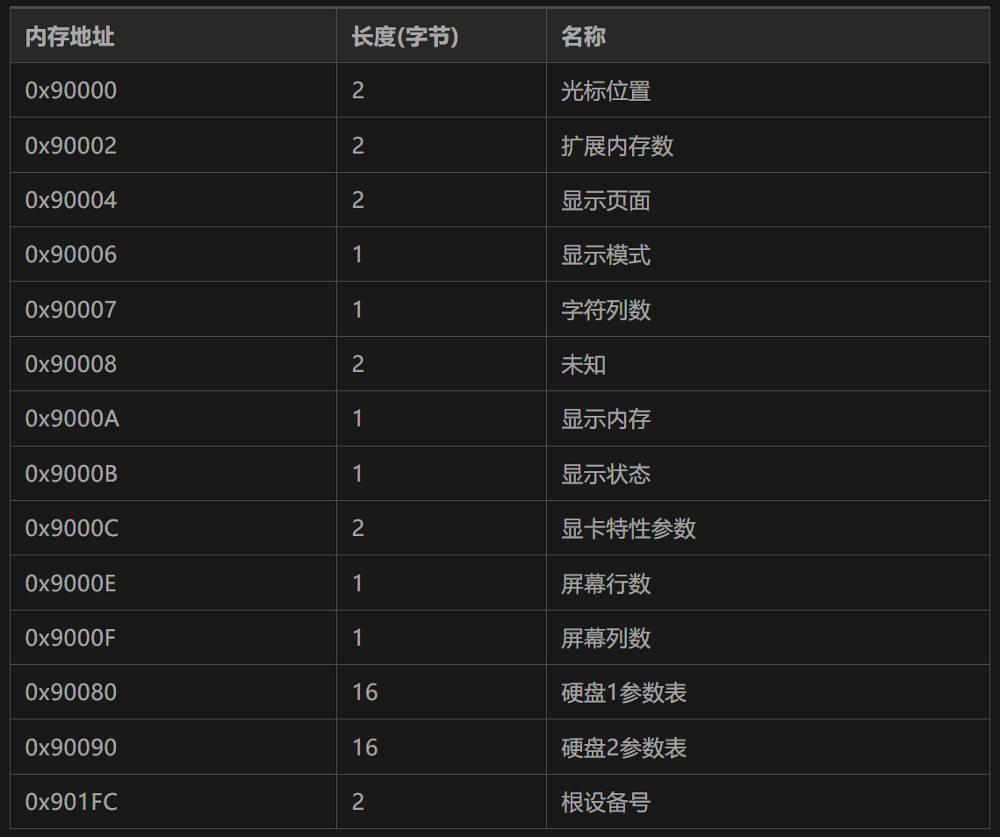
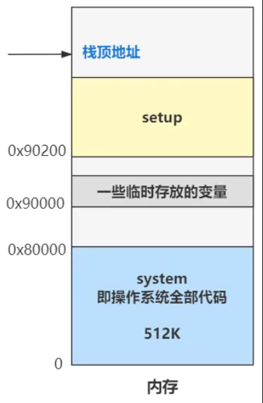

# 打开电源时BIOS都干了什么？

1. x86 PC刚开机时CPU处于实模式，CS=0xFFFF,IP=0x0000
2. 寻址0xFFFF0处（ROM BIOS 映射区）
3. 检查硬件
4. 将磁盘0磁道0扇区读入0x7c00处 （512字节）
5. 设置cs和ip指向0x7c00，开始执行bootsect.s中的内容


# bootsect.s 详解

## 转移阵地，规划内存

操作系统开始从这个汇编代码开始执行，让 ds 这个寄存器里的值变成了 0x07c0

```
BOOTSEG  = 0x07c0			! original address of boot-sector

entry start
start:
	mov	ax,#BOOTSEG
	mov	ds,ax
	...
```

ds 是一个 16 位的段寄存器，具体表示数据段寄存器，在内存寻址时充当段基址的作用。

BIOS 规定把操作系统代码加载到内存 0x7c00，那么里面的各种数据自然就全都被偏移了这么多，所以把数据段寄存器 ds 设置为这个值，方便以基址的方式访问内存里的数据。




```
BOOTSEG  = 0x07c0			! original address of boot-sector
INITSEG  = 0x9000			! we move boot here - out of the way

entry start
start:
	mov	ax,#BOOTSEG
	mov	ds,ax
	mov	ax,#INITSEG
	mov	es,ax
	mov	cx,#256
	sub	si,si
	sub	di,di
	rep
	movw
	jmpi	go,INITSEG
go:
	...
	...
```

此时 ds 寄存器的值已经是 0x07c0 了，然后又通过同样的方式将 es 寄存器的值变成 0x9000，接着又把 cx 寄存器的值变成 256;

movw 将 ds:si 处的一个字（2字节）复制到 es:di，重复了256次

因此上面的作用是将内存地址 0x07c00 处开始往后的 512 字节的数据，原封不动复制到 0x90000 处。并且跳转到此处往后再稍稍偏移 go 这个标签所代表的偏移地址处

```
go: mov ax,cs
    mov ds,ax
    mov es,ax
    mov ss,ax
    mov sp,#0xFF00
```

这段代码的直接意思很容易理解，就是把 cs 寄存器的值分别复制给 ds、es 和 ss 寄存器，然后又把 0xFF00 给了 sp 寄存器； sp 寄存器被赋值为了 0xFF00 了，所以目前的栈顶地址就是 ss:sp 所指向的地址 0x9FF00 处




## 加载setup扇区和system扇区

```
load_setup:
	mov	dx,#0x0000		! drive 0, head 0
	mov	cx,#0x0002		! sector 2, track 0
	mov	bx,#0x0200		! address = 512, in INITSEG
	mov	ax,#0x0200+SETUPLEN	! service 2, nr of sectors
	int	0x13			! read it
	jnc	ok_load_setup		! ok - continue
	mov	dx,#0x0000
	mov	ax,#0x0000		! reset the diskette
	int	0x13
	j	load_setup
```

注意 int 0x13 中断发起后，CPU 会通过这个中断号，去寻找对应的中断处理程序的入口地址，并跳转过去执行，逻辑上就相当于执行了一个函数。而 0x13 号中断的处理程序是 BIOS 提前给我们写好的，是读取磁盘的相关功能的函数。

dh=磁头号，dl=驱动器号
ch=柱面号，cl=开始扇区
ah=服务号，al=扇区数
ex:bx=内存地址

因此上面的作用就是将硬盘的第 2 个扇区开始，把数据加载到内存 0x90200 处，共加载 4 个扇区也就是setup



```
ok_load_setup:
	...
	mov	ax,#SYSSEG
	mov	es,ax		! segment of 0x010000
	call	read_it
	...
	jmpi	0,SETUPSEG
```

ok_load_setup的主干逻辑如上，省略了如输出等待字符，选择根设备等等与操作系统核心逻辑无关的代码；

其作用是把从硬盘第 6 个扇区开始往后的 240 个扇区，加载到内存 0x10000 处，最后跳转到setup处执行，也就该执行setup.s中的代码了




## 总结

bootsect.s 的主要任务是将操作系统代码加载到内存，然后跳转到 setup.s 的入口处执行。


# setup.s 详解

```
start:
	mov	ax,#INITSEG	! this is done in bootsect already, but...
	mov	ds,ax
	mov	ah,#0x03	! read cursor pos
	xor	bh,bh
	int	0x10		! save it in known place, con_init fetches
	mov	[0],dx		! it from 0x90000.
```

触发 BIOS 提供的显示服务中断处理程序，而 ah 寄存器被赋值为 0x03 表示显示服务里具体的读取光标位置功能;

这个 int 0x10 中断程序执行完毕并返回时，dx 寄存器里的值表示光标的位置，具体说来其高八位 dh 存储了行号，低八位 dl 存储了列号。

最终的内存地址是在 0x90000 处，这里存放着光标的位置，以便之后在初始化控制台的时候用到。

```
! Get memory size (extended mem, kB)

	mov	ah,#0x88
	int	0x15
	mov	[2],ax

! Get video-card data:

	mov	ah,#0x0f
	int	0x10
	mov	[4],bx		! bh = display page
	mov	[6],ax		! al = video mode, ah = window width

! check for EGA/VGA and some config parameters

	mov	ah,#0x12
	mov	bl,#0x10
	int	0x10
	mov	[8],ax
	mov	[10],bx
	mov	[12],cx

! Get hd0 data

	mov	ax,#0x0000
	mov	ds,ax
	lds	si,[4*0x41]
	mov	ax,#INITSEG
	mov	es,ax
	mov	di,#0x0080
	mov	cx,#0x10
	rep
	movsb

! Get hd1 data

	mov	ax,#0x0000
	mov	ds,ax
	lds	si,[4*0x46]
	mov	ax,#INITSEG
	mov	es,ax
	mov	di,#0x0090
	mov	cx,#0x10
	rep
	movsb
```

功能类似，和读取光标类似，不赘述了；

以下是最终存储的地址，可以发现0x90000以上存储了很多了操作系统所需的数据：



接下来关闭中断；

```
! now we want to move to protected mode ...

	cli			! no interrupts allowed !
```

因为要把原本是 BIOS 写好的中断向量表给覆盖掉，写上我们自己的中断向量表，所以这个时候是不允许中断进来的。


接下来把内存地址 0x10000 处开始往后一直到 0x90000 的内容，统统复制到内存的最开始的 0 位置

```
! first we move the system to it's rightful place

	mov	ax,#0x0000
	cld			! 'direction'=0, movs moves forward
do_move:
	mov	es,ax		! destination segment
	add	ax,#0x1000
	cmp	ax,#0x9000
	jz	end_move
	mov	ds,ax		! source segment
	sub	di,di
	sub	si,si
	mov 	cx,#0x8000
	rep
	movsw
	jmp	do_move

! then we load the segment descriptors

end_move:
```

此时的内存布局：



初始化GDT表
```
end_move:
	mov	ax,#SETUPSEG	! right, forgot this at first. didn't work :-)
	mov	ds,ax
	lidt	idt_48		! load idt with 0,0
	lgdt	gdt_48		! load gdt with whatever appropriate
```

 ds 寄存器里存储的值，在实模式下叫做段基址，在保护模式下叫段选择子。段选择子里存储着段描述符的索引

 通过段描述符索引，可以从全局描述符表 gdt 中找到一个段描述符，段描述符里存储着段基址。段基址取出来，再和偏移地址相加，就得到了物理地址，偏移和段基址都是32位的；也就可以访问4G的空间

 cs存放GDT的下标

 操作系统把全局描述符表（gdt）在内存中的什么位置信息存储在一个叫 gdtr 的寄存器中


这是以前16位机的历史遗留问题，实模式中最多20位地址，最多寻址1MB


进入保护模式：
```
 	mov	ax,#0x0001	! protected mode (PE) bit
	lmsw	ax		! This is it!
	jmpi	0,8		! jmp offset 0 of segment 8 (cs)
```

将ax加载到机器状态字（MSW）的低4位来开启保护模式

进入保护模式后，中断处理函数是在IDT中查找

## 总结

setup.s 的主要任务是移动操作系统，读取系统的参数并存放，初始化GDT表，进入保护模式，跳转到操作系统system代码执行。